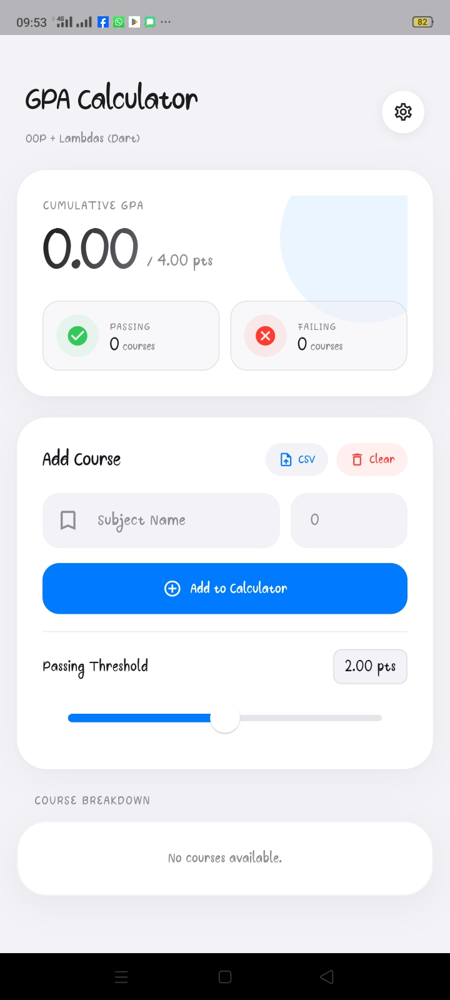

# GPA Calculator

<p align="center">
  <strong>Modern Dart/Flutter GPA App + OOP Exercises</strong>
</p>

<p align="center">
  
  
  
  
</p>

## UI Preview (Flutter)

<p>
  
  
</p>

## Project Scope

This branch is intentionally cleaned for focused review.

- `dart/flutter_gpa_calculator/`: Modern GPA calculator app with polished UI and CSV import.
- `exercies/dart/`: Three Dart exercises (inheritance, sealed classes, interfaces) plus a single runner.

## Core Concepts Implemented

- OOP modeling with dedicated domain classes (`CourseEntry`, `GpaReport`).
- Service-oriented business logic (`GradeParser`, `GpaCalculator`).
- Higher-order functions and lambdas (`map`, `where`, `fold`, sorting/comparators).
- Stateful UI composition with clear separation between UI and logic.

## Run

### Flutter App

```powershell
cd "dart/flutter_gpa_calculator"
flutter pub get
flutter run
```

### Exercises

```powershell
dart exercies/dart/run_all_exercises.dart
```

## Review Notes

- Commits are intentionally split into small, review-friendly units.
- Kotlin screenshots were removed to keep this README focused on the Dart app.
